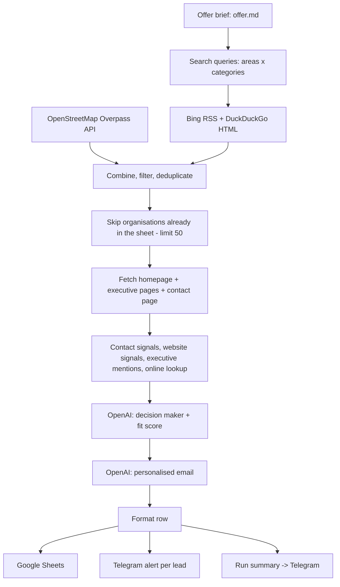

# Dhaka Healthcare Lead Generation Pipeline

Automated B2B prospecting for the healthcare sector of Dhaka, Bangladesh. Each run discovers organisations that are not yet in your CRM, identifies the decision maker from the organisation's own website, scores how well the organisation fits your offer, drafts a personalised first email, and logs everything to Google Sheets with Telegram alerts and a run report.

The pipeline ships in two equivalent forms:

- **n8n workflow** (`dhaka_healthcare_lead_gen_workflow.json`) - visual, scheduled, writes to Google Sheets, uses OpenAI for extraction and copywriting.
- **Standalone Python script** (`lead_generator.py`) - no dependencies beyond the standard library, writes CSV and an HTML report, and runs in a free offline mode without any API key.

  

## Contents

1. [Overview](#overview)
2. [Business case](#business-case)
3. [How it works](#how-it-works)
4. [Quick start](#quick-start)
5. [Configuration](#configuration)
6. [Output](#output)
7. [Decision-maker accuracy](#decision-maker-accuracy)
8. [Operations and limits](#operations-and-limits)
9. [Production path](#production-path)
10. [Repository layout](#repository-layout)
11. [Guardrails](#guardrails)

## Overview

| Capability | Detail |
| :--- | :--- |
| Lead discovery | Three free sources: OpenStreetMap (structured facility data), Bing and DuckDuckGo (web search). Up to 50 **new** organisations per run; anything already in the sheet / CSV is skipped, so the pipeline never repeats a company. |
| Decision-maker identification | Reads the homepage plus up to three executive pages ("Message from Chairman / Managing Director / CEO", board, management) and the contact page. Extracts name, title, direct email, direct phone, LinkedIn and other executives. Falls back to an online lookup (LinkedIn search results, news snippets) when the site names nobody. |
| Qualification | **Fit Score (1-5)** with a written reason, judged against your offer brief and deterministic website signals (online booking, patient portal, mobile app, telemedicine, online payment, tech stack, size). |
| Outreach draft | A first email that opens with a fact from the prospect's site, pitches the one or two capabilities from your brief that apply, and closes with your call to action and signature. |
| Delivery | Google Sheet or CSV (22 columns), Telegram alert per lead, end-of-run summary with business KPIs, self-contained HTML report. |

**Free mode vs. production mode.** Every stage - sources, deduplication, page reading, signals, sheet, alerts, report - is identical in both. The difference is who does the reading and writing:

| | Free mode (no API key) | Production (OpenAI) |
| :--- | :--- | :--- |
| Decision-maker extraction | Rule-based parser on the company's own pages, English and Bengali | `gpt-4o-mini` reads every page in context; transliterates Bengali names; reconciles executive mentions and lookup results |
| Email | Template composed from your brief and the site's facts | Written per lead by the model, following your brief's tone and length rules |
| Fit score | Rule-based: organisation type, size, digital gaps | Model judgement with reasoning, on the same evidence |
| Cost per 50-lead run | $0 | about $0.15-0.20 |

Measured on 22 September 2026 (free mode): 50 new leads per run while the search engines cooperate, a named decision maker for roughly 35-40 % of leads (7 of 8 among large private hospitals with English executive pages), a phone number for about 90 %, a fit score with evidence for every lead, approximately 15-21 hours of manual research replaced per run.

## Business case

### The problem

Prospecting Dhaka's healthcare sector by hand means, for every organisation: find it, find who runs it, find a phone number or email, understand what it lacks, and write an email that does not read like spam. Done properly this takes 20-30 minutes per lead. A batch of 50 costs a sales representative about two and a half working days, and quality falls as the day goes on.

### What changes

| Step | Manual | Pipeline |
| :--- | :--- | :--- |
| Find new organisations | Search engines, directories, memory | Three sources, deduplicated against the sheet, never repeated |
| Identify the decision maker | Browse the site, LinkedIn | Executive pages read automatically; online lookup when the site names nobody |
| Qualify | Judgement | Fit Score 1-5 with the evidence written down |
| Write the first email | Template plus edits | Opens with a fact from the prospect's site, one relevant product, your call to action |
| Log and notify | Copy into a sheet | Sheet row, Telegram alert, run summary, HTML report |

A run takes about 15 minutes unattended.

### Cost model

| Item | Monthly cost at one run per weekday (about 1,100 leads) |
| :--- | :--- |
| OpenAI `gpt-4o-mini` | about $4 |
| n8n | $0 self-hosted; n8n Cloud from about EUR 20 (check current pricing) |
| Google Sheets, Telegram, OpenStreetMap, Bing, DuckDuckGo | $0 |
| Optional Google Programmable Search (reliable lookups) | $0 within 100 queries per day |

### Impact model

- **Capacity:** one run per weekday x 50 leads = about 1,100 researched, qualified and drafted leads per month, replacing roughly 450 hours of manual research.
- **Pipeline:** `leads x reply rate x meeting rate x close rate x deal value`. With placeholder rates - 1,100 x 3 % replies x 30 % meetings x 20 % close - that is about two new customers per month. Replace the rates with your own after the first 200 emails; the sheet is where they are tracked.
- **Focus:** sort the sheet by Fit Score and call the 4-5 leads first. `TELEGRAM_MIN_FIT=4` limits per-lead alerts to those.

### Demo in ten minutes (free, no accounts)

1. Run `python lead_generator.py` with `offer.md` in place. The console shows every lead being researched.
2. Open `run_report.html`: KPI tiles, fit distribution, sources, and every lead with its decision maker and email draft.
3. Open `dhaka_healthcare_leads.csv`: the same 22 columns the Google Sheet will have.
4. Import `dhaka_healthcare_lead_gen_workflow.json` into n8n and show the canvas: the same pipeline with Google Sheets, Telegram and a daily schedule ready to enable.

Run the script once, fresh, shortly before the meeting. Bing and DuckDuckGo throttle an address that has searched heavily in the preceding hours; the script waits out one cooldown and retries, but cannot force them. One run per hour from one machine is well within their tolerance.

## How it works



### Lead sources

| Source | What it provides | Notes |
| :--- | :--- | :--- |
| OpenStreetMap (Overpass API) | Every hospital, clinic, diagnostic centre, dental practice and pharmacy in the Dhaka bounding box that has a website tagged; phone, email and address where mapped | Structured, keyless. Finite: after the first run these are known and the search engines take over. Widen the bounding box (`23.68,90.30,23.92,90.50` = south, west, north, east) to cover Savar, Gazipur or Narayanganj. |
| Bing (RSS output) | About 10 results per query, mostly the organisation's own website | Bing answers suspected automated traffic with an unrelated cached page; the relevance filter (Dhaka / Bangladesh / `.bd`) discards it. |
| DuckDuckGo (HTML endpoint) | About 10 results per query, more directory sites | Serves a captcha page when throttling; the run continues with Bing. |

Queries are built from an `areas` list x a `categories` list, shuffled each run, roughly 30 per run, each sent to both engines. Directory and aggregator sites, social networks, blog articles and non-healthcare government portals are filtered out.

### Pipeline stages (n8n node numbers)

| # | Node | Purpose |
| :-- | :--- | :--- |
| 0 | Offer Profile | Holds your `offer.md` brief; parses optional target lists; provides the AI context for nodes 9 and 10 |
| 1 | Search Query Generator | Builds the area x category queries, one URL per engine |
| 1b | OpenStreetMap Healthcare Lookup | Overpass query for the Dhaka bounding box |
| 2 | Web Search (Bing + DuckDuckGo) | Fetches the search pages, one request per second, continues when an engine blocks |
| 3 | Extract Search Results | Parses both engines; applies the relevance, aggregator and article filters |
| 3b | Parse OpenStreetMap Leads | Converts facilities into candidates carrying known phone, email, address and type |
| 3c | Combine Candidates | Merges the two branches |
| 4 | Remove Duplicates | One lead per domain |
| 5 | Read Existing Leads | Loads the `Website` column of the sheet |
| 6 | Skip Known Leads and Limit to 50 | Drops known organisations, keeps the first 50 new ones |
| 7 | Fetch Company Homepage | Downloads each homepage, continues on failure |
| 8 | Extract Page Text and Contact Signals | Follows meta-refresh redirects and records why a site gave nothing; fetches up to three executive pages and the contact page (head and tail of each, since executive messages are signed at the bottom); extracts emails, phones, LinkedIn, Facebook, executive mentions and website signals; runs the online decision-maker lookup when the pages name nobody |
| 9 | OpenAI Decision Maker Extractor | `gpt-4o-mini`, JSON mode: organisation profile, decision maker, other executives, Fit Score and reason |
| 10 | OpenAI Personalised Email Writer | `gpt-4o-mini`, JSON mode: subject, body, hook |
| 11 | Merge and Format Lead Payload | Builds the sheet row and Telegram message; cleans company names, normalises phones to `+880`, fills gaps from OpenStreetMap |
| 12 | Save to Google Sheets | Appends the row |
| 12b | Filter Telegram Alerts | Passes leads with Fit Score >= `MIN_FIT_ALERT` (default 0 = all) |
| 13 | Telegram Lead Alert | One message per lead |
| 14 | Build Run Summary | Leads saved, sources, fit distribution, decision makers found, hours replaced, AI cost, top five fits |
| 15 | Telegram Run Summary | Sends the summary; reports when a run found nothing new and why |
| - | Daily Schedule (disabled) | Weekday 09:00 Asia/Dhaka trigger; enable the node and activate the workflow to run unattended |

## Quick start

### Python

```bash
cp .env.example .env          # optional: OPENAI_API_KEY, Telegram values, Google Programmable Search key
cp offer.example.md offer.md  # describe your company and products (a free-text brief also works)
python lead_generator.py
```

Requires Python 3.9 or later, standard library only. Without an OpenAI key the script runs in free mode. Each run appends up to 50 new leads to `dhaka_healthcare_leads.csv`, writes `run_report.html`, prints a run summary and, if configured, sends Telegram alerts.

### n8n

1. **Import** `dhaka_healthcare_lead_gen_workflow.json` (Workflows > Import from File).
2. **Offer brief:** open node 0 and paste the contents of `offer.md` between the backticks. n8n Cloud cannot read local files.
3. **OpenAI:** create an OpenAI credential and select it in nodes 9 and 10.
4. **Google Sheets:** create a sheet and put the 22 column headers in row 1 - the quickest way is File > Import > `sheet_headers.csv` > Replace current sheet. Create a Google Sheets OAuth2 credential (the Google Cloud project behind it must have the Google Sheets and Google Drive APIs enabled). In nodes 5 and 12 select the credential, set Document to the sheet (By ID or By URL) and Sheet to the tab name.
5. **Telegram:** create a bot with `@BotFather`, create a Telegram credential with the token, and set the chat ID in nodes 13 and 15.
6. Run once with **Test workflow**. Enable the Daily Schedule node and activate the workflow when ready.

Credentials are never stored in the workflow file; it is safe to share once they live in n8n.

## Configuration

### Offer brief (`offer.md`)

A plain-text or Markdown description of your company, products, target customers and writing preferences. It is read by both versions and drives four things:

| Effect | Mechanism |
| :--- | :--- |
| Email content | The writer opens with a concrete observation from the prospect's site, connects it to the one or two capabilities from the brief that fit, states the likely outcome, and closes with the brief's call to action and signature. The brief's own rules (word limit, subject length, tone) override the defaults. |
| Fit Score and reason | How well the organisation matches the brief's target customers and could use its products, with evidence from the site. |
| Decision-maker preference | When several executives are listed, the one whose title matches the brief's `## Target decision makers` list is chosen. |
| Search targeting | Optional `## Target healthcare types` and `## Target areas` bullet lists replace the default categories and areas. |

`offer.example.md` is a sectioned template; lines containing `TODO` are ignored until replaced. Bracketed sender placeholders such as `[Sender Name]` are left untouched in the drafts so they can be filled once. The brief is included in every AI call (capped at 6,000 characters).

### Targeting

Edit the lists in `lead_generator.py` or node 1:

```js
const areas = ['Dhanmondi', 'Gulshan', 'Banani', 'Uttara', 'Mirpur', 'Mohakhali', 'Panthapath', 'Motijheel', ...];
const categories = ['hospital', 'diagnostic center', 'clinic', 'pharmaceutical company', 'medical equipment supplier', ...];
const MAX_QUERIES = 30;
```

Examples: pharmaceutical companies only - areas `Tejgaon, Motijheel, Banani, Uttara, Gulshan, Savar, Gazipur`, categories `pharmaceuticals ltd, medicine manufacturer, pharma company head office`; medical equipment suppliers only - areas `Purana Paltan, Bijoy Sarani, Green Road, Dhanmondi, Motijheel, Mirpur`, categories `medical equipment importer, surgical instrument supplier, hospital equipment supplier`.

### Environment and constants (Python)

| Setting | Purpose | Default |
| :--- | :--- | :--- |
| `OPENAI_API_KEY` | Enables production mode | unset (free mode) |
| `OPENAI_MODEL` | Chat model with JSON mode | `gpt-4o-mini` |
| `TELEGRAM_BOT_TOKEN`, `TELEGRAM_CHAT_ID` | Per-lead alerts and run summary | unset (no alerts) |
| `TELEGRAM_MIN_FIT` | Per-lead alerts only for this fit score and above | `0` |
| `OFFER_FILE` | Path to the brief | `offer.md` next to the script |
| `GOOGLE_CSE_KEY`, `GOOGLE_CSE_CX` | Google Programmable Search for reliable decision-maker lookups | unset |
| `LEADS_PER_RUN`, `MAX_QUERIES` | Run size and query budget | 50, 30 |
| `DHAKA_BBOX`, `USE_OPENSTREETMAP` | OpenStreetMap coverage | Dhaka metropolitan area, on |
| `MAX_ONLINE_LOOKUPS` | Decision-maker searches per run | 20 |
| `ENGINE_COOLDOWN_SECONDS`, `MAX_SEARCH_PASSES` | Behaviour when a search engine throttles | 120, 2 |

## Output

### Sheet and CSV columns (22)

`Company Name`, `Healthcare Type`, `Dhaka Location`, `Full Address`, `Website`, `Phone`, `Generic Email`, `Facebook Page`, `Key Services`, `Fit Score`, `Fit Reason`, `Website Signals`, `Decision Maker Name`, `Decision Maker Title`, `Decision Maker Email`, `Decision Maker Phone`, `Decision Maker LinkedIn`, `Other Decision Makers`, `Email Subject`, `Personalized Hook`, `Personalized Email`, `Timestamp`

`Website Signals` records the deterministic checks of the prospect's site (online appointment booking, online reports / patient portal, mobile app, telemedicine, online payment, live chat, tech stack, beds / branches / doctors / departments, copyright year, HTTPS) or, when the site could not be read, the reason (`website: dns failure (domain no longer exists)`, `http 403 (blocks automated visits)`, `parked / default page`). Phones are normalised to `+880` format. Decision-maker emails marked `(predicted)` follow the company's address pattern and were not verified.

### Run report (`run_report.html`)

Written by the Python script at the end of every run: KPI tiles (new leads, decision makers identified, high-fit leads, hours of manual research replaced, AI cost), fit distribution, sources, and a table of every lead with its decision maker, contact details, fit reason, website signals and email draft. Self-contained; suitable for sharing with people who will not open a CSV.

### Run summary

Printed by the script and sent to Telegram by node 15:

```text
RUN SUMMARY - 2026-09-22 10:31
50 new leads saved to Google Sheets
Sources: openstreetmap 37 · bing 8 · duckduckgo 5
Offer fit: 5★ 6 · 4★ 14 · 3★ 20 · ≤2★ 10
Decision maker found: 31/50 · direct email 22 · phone 44 · email 50
Manual research replaced: ~20.8 h (50 leads x 25 min) · AI cost: ~$0.15

Top fits
1. Green Life Hospital Ltd - 5/5 - Dr. Md. Mainul Ahasan (Managing Director)
   No online appointment booking or patient portal on a multi-department hospital site
```

When a run finds nothing new, the summary says so and why (all candidates already in the sheet, or sources throttled).

### Telegram alert (per lead)

```text
NEW DHAKA HEALTHCARE LEAD

Company: Asgar Ali Hospital
Type: Hospital
Location: Gendaria
Address: 111/1/A Distillery Road, Gandaria, Dhaka 1204
Website: https://asgaralihospital.com/
Phone: +88029612345
Email: info@asgaralihospital.com
Offer fit: 5/5 - sizeable organisation (800 beds); no online reports, telemedicine or live chat

DECISION MAKER
Name: Md. Hasan
Title: Managing Director
Direct Email: md@asgaralihospital.com (predicted)

Draft Subject: Same-day digital reports for Asgar Ali Hospital
Hook: Looking at Asgar Ali Hospital's website (800 beds), I noticed patients still cannot download their reports online
```

Lines without data are omitted.

## Decision-maker accuracy

On a free-mode run of 37 leads (22 September 2026), the 25 leads without a named decision maker were examined individually:

| Leads | Cause | Handling |
| :--- | :--- | :--- |
| 5 | Website no longer exists (DNS failure; stale OpenStreetMap entry) | Status recorded in Website Signals; online lookup attempted |
| 2 | Site redirects with a meta-refresh (United Hospital to continental.health) | Redirect followed; the lead becomes the real site, merged if that site is already a lead |
| 4 | Site dead, broken or bot-blocked (parked page, HTTP 500, HTTP 403) | Status recorded; online lookup attempted |
| 10 | Site works but names nobody | Online lookup: LinkedIn profile results first (`Name - Managing Director - Company \| LinkedIn`), then news and directory snippets |
| 2 | Page in Bengali | Bengali executive titles and honorifics parsed; the AI transliterates |
| 2 | Name adjacent to the title in an unusual layout | Parser handles heading forms, chronological director lists and glued words |

Where the site itself names someone, the free parser finds them in about 7 of 8 cases. Where the site names nobody or is dead - roughly half of Dhaka healthcare sites - no parser can help; only an external source can.

Three levers, cheapest first:

1. **Online lookup (built in, free).** Up to 20 searches per run, only for leads whose pages name nobody. Bing and DuckDuckGo throttle heavy use and ignore `site:` operators on their feed endpoints, so the yield varies. Adding a Google Programmable Search key (`GOOGLE_CSE_KEY`, `GOOGLE_CSE_CX`; free tier 100 queries per day) makes the lookup dependable: it honours `site:linkedin.com/in` and never serves decoy pages.
2. **OpenAI (production).** Reads every fetched page in context, transliterates Bengali names, and reconciles executive mentions with lookup results. Raises the hit rate on sites that name someone in an unusual way; cannot invent a name for a site that names nobody.
3. **Contact enrichment API (production, paid).** Apollo.io, Hunter.io, RocketReach or Lusha return verified executives with email and mobile number for a company domain - the two fields the free path can only predict. A few US cents per lookup with free monthly allowances. Add one HTTP node between nodes 9 and 10 (or one function after `identify_decision_maker_with_openai` in Python) and map the result onto the Decision Maker Email / Phone / LinkedIn columns.

Every row states where its decision maker came from (the company's own page, a LinkedIn search result, a news snippet). Treat the decision-maker columns as research completed, not contacts verified; verification is what lever 3 provides.

## Operations and limits

- **Deduplication.** The sheet (n8n) or CSV (Python) is the memory: every run reads the `Website` column and only processes new domains. A CSV with an older column layout is backed up automatically and a fresh one started.
- **Fewer than 50 leads.** The run only outputs organisations not already known. When a niche is exhausted or both search engines throttle at the same time, fewer new leads exist. Widen the areas and categories, raise `MAX_QUERIES`, or enlarge the OpenStreetMap bounding box. If every source fails, node 3 falls back to a curated list of well-known Dhaka providers so the rest of the pipeline can still be exercised.
- **Search-engine throttling.** An engine that answers with a block or captcha page is rested for `ENGINE_COOLDOWN_SECONDS` while the other continues; the Python script makes one further pass after the cooldown. Keep development runs to about one per hour per machine.
- **Retries.** OpenAI calls retry three times on rate limits and server errors before falling back to the rule-based parser; Telegram nodes retry on rate limits.
- **Scheduling.** The n8n workflow contains a disabled weekday 09:00 (Asia/Dhaka) trigger.

## Production path

1. Add an OpenAI key (n8n credential or `.env`) - about $4 per month at one run per weekday.
2. Add a Google Programmable Search key for dependable decision-maker lookups (free tier).
3. Add a contact-enrichment API for verified email and phone (paid, per lookup).
4. Host n8n (self-hosted or Cloud), enable the schedule, and route the sheet into the CRM of choice - n8n has native nodes for HubSpot, Odoo, Pipedrive and Zoho.
5. Extend coverage: other cities (areas and bounding box), other verticals the company sells to (swap `offer.md` and the categories - for example schools, colleges and universities for education products), reply tracking via a Gmail or Outlook trigger.

## Repository layout

| File | Purpose |
| :--- | :--- |
| `dhaka_healthcare_lead_gen_workflow.json` | n8n workflow (import as-is) |
| `lead_generator.py` | Standalone Python pipeline |
| `offer.md` | Your offer brief (drives emails, fit score, targeting) |
| `offer.example.md` | Sectioned template for the brief |
| `.env.example` | Environment template; copy to `.env` (never committed) |
| `sheet_headers.csv` | The 22 column headers, for importing into a new Google Sheet |
| `dhaka_healthcare_leads.csv` | Cumulative output of the Python script |
| `run_report.html` | Report of the last Python run |

## Guardrails

- Emails are drafts. A person verifies the decision maker and replaces the sender placeholders before anything is sent. The pipeline researches and drafts; it does not send.
- Data comes from the organisations' public websites and OpenStreetMap (ODbL - attribute OpenStreetMap if the data is redistributed).
- Keep sending volumes and opt-out wording within Bangladeshi regulations and your email provider's terms.
- API keys belong in n8n credentials or the local `.env` file, never in the workflow JSON or the script.
