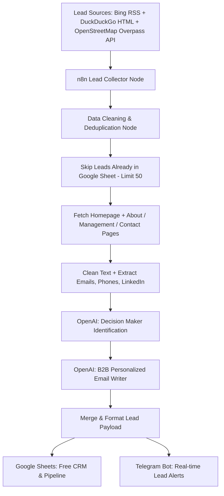

# 🏥 End-to-End Healthcare Lead Generation Workflow (Dhaka, Bangladesh)

An automated B2B Lead Generation and Decision-Maker Extraction pipeline designed specifically for the **Healthcare Sector in Dhaka, Bangladesh**. Built for **n8n** using **OpenAI API (Paid)** + **100% Free Tools** (Scraping, Google Sheets, Telegram Bot). A standalone Python version of the same pipeline is included for running without n8n.

**Every execution delivers up to 50 new leads** from three free sources - Bing, DuckDuckGo and OpenStreetMap - and the workflow reads the websites already stored in your Google Sheet, skips them, and only processes companies it has never seen before - so the sheet keeps growing without duplicates. For each lead it visits the homepage *and* the about / management / contact pages to capture every decision-maker detail it can find (name, title, direct email, direct phone, LinkedIn, other executives, address, Facebook page, services).

---

## 💼 Business Case & Demo Guide

### The problem
Prospecting Dhaka's healthcare sector by hand means, for every organisation: find it, find who runs it, find a phone / email, work out what it lacks, write an email that does not read like spam. Done properly that is **20-30 minutes per lead** - a batch of 50 costs a sales rep about **two and a half working days**, and the quality drops as the day goes on.

### What the pipeline does instead (unattended, ~15 minutes per run)
| Step | Manual today | Pipeline |
| :--- | :--- | :--- |
| Find new organisations | Google, directories, memory | 3 free sources (OpenStreetMap, Bing, DuckDuckGo), never repeats a company already in the sheet |
| Identify the decision maker | Browse the site, LinkedIn | Reads the homepage **and** the "Message from Chairman / MD / CEO", board and contact pages; extracts name, title, direct email / phone where published |
| Qualify | Gut feeling | **Fit Score 1-5** against your `offer.md` with the evidence (digital gaps, size, type) written down |
| Write the first email | Template + tweaks | Opens with a fact from *their* site, pitches the one product that fits, your call to action and signature |
| Log and notify | Copy-paste into a sheet | Google Sheet / CSV row, Telegram alert per lead, run summary, HTML report |

### Demo in 10 minutes - free, no API keys, no accounts
1. `python lead_generator.py` with `offer.md` in place - the console shows every lead being researched.
2. Open **`run_report.html`** (written at the end of every run): KPI tiles, fit distribution, sources, and every lead with its decision maker and email draft - click a subject line to read the email.
3. Open **`dhaka_healthcare_leads.csv`** - the same 22 columns the Google Sheet will have.
4. Import **`dhaka_healthcare_lead_gen_workflow.json`** into n8n and show the canvas: the identical pipeline as a visual workflow with Google Sheets, Telegram and a daily schedule ready to switch on.

What a good demo run looks like on the free path (measured 22 Sep 2026): **50 new leads** per run while the search engines cooperate (37 from OpenStreetMap alone in a run where both engines were rate-limiting the machine after hours of testing), decision maker named for **~35-40 %** of them (7 of 8 among large private hospitals with English executive pages), phone for ~90 %, a fit score with written evidence for every lead, ~15-21 hours of manual research replaced, cost **$0**.

> Tip for demo day: run the script once, fresh, shortly before the meeting - Bing and DuckDuckGo throttle an address that has searched heavily in the previous hours, and the script waits out one cooldown and retries but cannot force them. One run per hour from one machine is comfortably within their tolerance; a full day of back-to-back test runs is not.

### Free demo vs. production
| | Free demo (today) | Production |
| :--- | :--- | :--- |
| Decision-maker extraction | Rule-based parser on the company's own pages | **OpenAI `gpt-4o-mini`** reads every page in context (Bengali names, unusual layouts, PDFs linked as text) - higher hit rate, cleaner titles |
| Email | Template filled from your brief + website facts | Written per lead by the model: specific observation, product fit, outcome, your tone rules |
| Fit score | Rule-based (type, size, digital gaps) | Model judgement with reasoning, using the same evidence |
| Cost | $0 | **~$0.15-0.20 per 50-lead run** (~$4 / month at one run per weekday) |
| Hosting | Your laptop | n8n self-hosted (free) or n8n Cloud (from ~€20 / month - check current pricing); Google Sheets and Telegram stay free |

Everything else - sources, deduplication, page reading, signals, sheet, alerts, report - is identical in both modes, so the demo shows the real system, not a mock-up.

### Impact model (put your own numbers in)
- **Capacity:** 1 run per weekday x 50 leads = **~1,100 researched, qualified, drafted leads per month**, replacing ~450 hours of manual research.
- **Pipeline:** `leads x reply rate x meeting rate x close rate x deal value`. Example with conservative placeholders - 1,100 x 3 % replies x 30 % meetings x 20 % close = **~2 new customers per month**; replace the rates with your own once the first 200 emails have gone out (the sheet is where you track it).
- **Focus:** the Fit Score lets the team call the 4-5★ leads first; with `TELEGRAM_MIN_FIT=4` only those trigger an alert.

### Scale-out after the pilot
- **Other cities / regions:** change `AREAS` and the OpenStreetMap bounding box (Chattogram, Sylhet, Savar-Gazipur industrial belt).
- **Other verticals the company already sells to:** swap `offer.md` and the search categories - e.g. `school`, `college`, `university` for the education products - nothing else changes.
- **CRM:** n8n has native nodes for HubSpot, Odoo, Pipedrive and Zoho; replace or duplicate node 12.
- **Reply tracking:** a Gmail / Outlook trigger in n8n can mark replies in the sheet and stop follow-ups.

### Guardrails
- Emails are **drafts**: a human verifies the decision maker and replaces the bracketed sender placeholders before sending. Addresses marked `(predicted)` follow the company's pattern and were not verified.
- Data comes from the organisations' public websites and OpenStreetMap (ODbL - attribute OSM if you redistribute the data).
- Keep sending volumes and opt-out wording within Bangladesh's and your email provider's rules; the pipeline researches and drafts, it does not send.

---

## 📸 Workflow Architecture

The workflow matches your architecture diagram step-by-step:



| # | n8n Node | Purpose |
| :-- | :--- | :--- |
| 0 | Offer Profile | Your `offer.md` brief (paste it into this node): who you are, what you sell, whom to target. Drives the targeting, the fit score and the personalised email |
| 1 | Search Query Generator | ~30 area x category search queries, shuffled every run, each emitted for **both** engines (edit here to retarget) |
| 1b | OpenStreetMap Healthcare Lookup | Free Overpass API query: every hospital / clinic / diagnostic / dental / pharmacy facility in the Dhaka bounding box that has a website - with phone, email and address when mapped |
| 2 | Web Search (Bing + DuckDuckGo) | Free scraping of Bing's RSS output and DuckDuckGo's HTML page, one request per second, continues when an engine blocks |
| 3 | Extract Search Results | Parse title / URL / snippet from either engine; drop social, directory and aggregator pages and anything not about Dhaka / Bangladesh (this also discards the unrelated cached pages Bing serves to suspected bots) |
| 3b | Parse OpenStreetMap Leads | Turns the Overpass answer into candidates carrying `known_phone` / `known_email` / `known_address` / `known_type` |
| 3c | Combine Candidates | Merge (append) of the search-engine and OpenStreetMap branches |
| 4 | Remove Duplicates (this run) | One lead per domain |
| 5 | Read Existing Leads (Google Sheets) | Loads the `Website` column of your sheet |
| 6 | Skip Known Leads & Limit to 50 | Drops anything already in the sheet, keeps the first 50 new leads |
| 7 | Fetch Company Homepage | Downloads each homepage (continues on failure) |
| 8 | Extract Page Text & Contact Signals | Follows meta-refresh redirects and records why a site gave nothing (dead domain, 403, parked); follows up to 3 executive pages ("Message from Chairman / MD / CEO", board, management, about) plus the contact page - head **and** tail of each, because executive messages are signed at the bottom; pulls emails, phones, LinkedIn, Facebook; extracts the text around every executive title (**executive mentions**); runs the **website signal checks** (online booking, patient portal, app, telemedicine, online payment, live chat, tech stack, beds / branches / doctors, site freshness); when the pages name nobody, runs the **online decision-maker lookup** (LinkedIn profiles first); passes the OpenStreetMap facts through |
| 9 | OpenAI Decision Maker Extractor | `gpt-4o-mini`, JSON mode - all decision-maker details, plus **Fit Score / Fit Reason** against your offer |
| 10 | OpenAI Personalized Email Writer | `gpt-4o-mini`, JSON mode - opens with a specific observation from the prospect's site, pitches the 1-2 capabilities from your offer that fit, uses your call to action and signature |
| 11 | Merge & Format Lead Payload | Builds the sheet row + Telegram message; cleans SEO tails off company names, normalises phones to `+880…`, OpenStreetMap facts fill any gap the AI left |
| 12 | Save to Google Sheets | Appends the new rows to your free CRM |
| 12b | Filter Telegram Alerts | Passes only leads with Fit Score ≥ `MIN_FIT_ALERT` (node 0; default 0 = all) to the per-lead alert |
| 13 | Telegram Lead Alert | One alert per lead (retries on rate limits) |
| 14 | Build Run Summary | One message per execution: leads saved, sources, fit distribution, decision makers found, hours of manual research replaced, AI cost, top 5 fits |
| 15 | Telegram Run Summary | Sends that summary (also tells you when a run found nothing new and why) |
| – | Daily Schedule (disabled) | Weekday 09:00 Asia/Dhaka trigger - enable the node and activate the workflow to run hands-free |

---

## 🛠️ Stack & Cost Breakdown

| Component | Tool / Service | Cost |
| :--- | :--- | :--- |
| **Workflow Engine** | [n8n](https://n8n.io/) (Self-Hosted / Desktop / Cloud) | **FREE** |
| **Web Scraper & Search** | n8n HTTP Request + Bing RSS + DuckDuckGo HTML (no API keys) | **FREE** |
| **Structured Facility Data** | OpenStreetMap Overpass API (no API key) | **FREE** |
| **Deduplication & Cleaning** | Native n8n JavaScript Code Nodes | **FREE** |
| **AI Intelligence** | **OpenAI API Key** (`gpt-4o-mini`) | **PAID** (~$0.001 per lead) |
| **CRM & Data Storage** | **Google Sheets API** | **FREE** |
| **Instant Alerts** | **Telegram Bot API** | **FREE** |

---

## 🚀 How to Import and Setup

### Step 1: Import the Workflow into n8n
1. Open your n8n Dashboard.
2. Click on **Workflows** -> **Import from File**.
3. Select the file [`dhaka_healthcare_lead_gen_workflow.json`](dhaka_healthcare_lead_gen_workflow.json).

---

### Step 2: Configure Credentials

> ⚠️ Never paste API keys directly into the workflow JSON or the Python script. Use n8n credentials (below) and a local `.env` file (see [`.env.example`](.env.example)). The workflow file is safe to share once credentials are stored in n8n.

#### 1. OpenAI API Key (Paid)
1. Go to `n8n Credentials` -> `Add Credential` -> **OpenAI**.
2. Paste your API key (`sk-proj-...`) and save.
3. Open nodes **9 (OpenAI Decision Maker Extractor)** and **10 (OpenAI Personalized Email Writer)** and select this credential in the **Credential for OpenAI** dropdown.

#### 2. Google Sheets (Free)
1. Create a Google Sheet (any name, e.g. `Dhaka Healthcare Leads`).
2. In the first tab (`Sheet1`) add this header row in row 1, in this order (22 columns):

| Company Name | Healthcare Type | Dhaka Location | Full Address | Website | Phone | Generic Email | Facebook Page | Key Services | Fit Score | Fit Reason | Website Signals | Decision Maker Name | Decision Maker Title | Decision Maker Email | Decision Maker Phone | Decision Maker LinkedIn | Other Decision Makers | Email Subject | Personalized Hook | Personalized Email | Timestamp |
|---|---|---|---|---|---|---|---|---|---|---|---|---|---|---|---|---|---|---|---|---|---|

   (Upgrading an existing sheet: insert the `Fit Score`, `Fit Reason` and `Website Signals` columns after `Key Services`.)

3. Copy your Sheet ID from the URL (`https://docs.google.com/spreadsheets/d/YOUR_SHEET_ID/edit`).
4. In **both** Google Sheets nodes - **5 (Read Existing Leads)** and **12 (Save to Google Sheets)** - set **Document** → *By ID* → paste `YOUR_SHEET_ID`, select your Google Sheets OAuth2 credential, and change **Sheet** if your tab is not called `Sheet1`. Node 5 is what makes every run skip leads you already have.

#### 3. Telegram Bot Notifications (Free)
1. Open Telegram and search for `@BotFather`.
2. Type `/newbot` to generate a bot token (e.g., `123456789:ABCdefGHI...`).
3. Create a **Telegram** credential in n8n with that token.
4. Start a chat with your bot (or add it to a group/channel) and get your Chat ID via `@userinfobot`.
5. In node **13 (Telegram Lead Alert)**, select the credential and replace `YOUR_TELEGRAM_CHAT_ID` with your Chat ID.

---

## 🎯 Targeting Specific Dhaka Healthcare Sectors

Node **1 (Search Query Generator)** combines an `areas` list with a `categories` list, shuffles the combinations and uses ~30 of them per run - so successive runs keep discovering new companies. Edit either list to retarget:

```js
const areas = ['Dhanmondi', 'Gulshan', 'Banani', 'Uttara', 'Mirpur', 'Mohakhali', 'Panthapath', 'Motijheel', ...];
const categories = ['hospital', 'diagnostic center', 'clinic', 'pharmaceutical company', 'medical equipment supplier', ...];
const MAX_QUERIES = 30;   // more queries = bigger candidate pool per run, but slower (2 requests per query, 1 s apart)
```

### Preset: Pharmaceutical Companies only
```js
const areas = ['Tejgaon', 'Motijheel', 'Banani', 'Uttara', 'Gulshan', 'Savar', 'Gazipur'];
const categories = ['pharmaceuticals ltd', 'medicine manufacturer', 'pharma company head office'];
```

### Preset: Medical Equipment Importers & Suppliers only
```js
const areas = ['Purana Paltan', 'Bijoy Sarani', 'Green Road', 'Dhanmondi', 'Motijheel', 'Mirpur'];
const categories = ['medical equipment importer', 'surgical instrument supplier', 'hospital equipment supplier'];
```

### Where the leads come from

| Source | What it gives | Notes |
| :--- | :--- | :--- |
| **OpenStreetMap** (node 1b / 3b) | ~40 Dhaka facilities that have a website tagged; ~75 % with phone, ~25 % with email, all with an address | Structured data, no scraping needed. Finite: after the first run these are all "known" and the search engines take over. Edit the bounding box in node 1b (`23.68,90.30,23.92,90.50` = south,west,north,east) to cover Savar / Gazipur / Narayanganj. |
| **Bing** (RSS output) | ~10 results per query, mostly the facility's own website | Bing sometimes answers automated traffic with an unrelated cached results page; node 3 recognises that (no Dhaka / Bangladesh mention) and drops the whole page. |
| **DuckDuckGo** (HTML endpoint) | ~10 results per query, more directory sites | Serves a captcha page when it throttles; the run simply continues with Bing. |

**Why you might get fewer than 50:** the run only outputs companies that are *not already in your sheet*. Once a niche is exhausted (or both engines throttle automated searches at the same time), fewer new leads exist - widen the `areas` / `categories` lists, raise `MAX_QUERIES` or enlarge the OpenStreetMap bounding box to keep hitting 50. If every source returns almost nothing, node 3 falls back to a curated list of well-known Dhaka providers so the rest of the pipeline can still be tested.

---

## 🎁 Your Offer Brief (`offer.md`) - tailored emails and lead fit

Both versions read [`offer.md`](offer.md): a plain-text / markdown brief about **your** company, products and target customers. It is what turns a generic "partnership" email into a specific pitch, and what lets the AI score how well each lead fits you.

| What it changes | How |
| :--- | :--- |
| **Email content** | The writer opens with one concrete observation from the prospect's site (a service, department, branch, accreditation, technology or scale), connects it to the 1-2 capabilities from your brief that fit best, states the likely operational outcome, and closes with *your* call to action and signature. Your brief's own rules (word limit, subject-line length, tone) override the defaults. |
| **Fit Score / Fit Reason** | Two columns (1-5 plus one sentence of evidence) so you can sort the sheet and call the best-fit leads first. |
| **Website Signals** | Deterministic checks of the prospect's own HTML, stored in a column and handed to the AI as evidence: online appointment booking, online reports / patient portal, mobile app, telemedicine, online payment, live chat / WhatsApp, tech stack (WordPress, Wix, …), beds / branches / doctors / departments, copyright year (stale site?), HTTPS. A *missing* feature is the most specific opener a software or service vendor can have. |
| **Decision-maker choice** | If several executives are listed, the one whose title matches your `## Target decision makers` list is picked. |
| **Search targeting** | Optional `## Target healthcare types` and `## Target areas` bullet lists replace the default search categories / areas. |

Getting started: `cp offer.example.md offer.md` and fill it in (lines containing `TODO` are ignored until you replace them), or simply write a free-text brief - the current [`offer.md`](offer.md) is a free-text example for a software company selling a hospital-management system. Bracketed placeholders such as `[Sender Name]` are left untouched in the generated emails so you can fill them once. The brief is sent with every AI call (capped at 6 000 characters, about US$0.002 extra per lead).

- **Python:** the file is picked up automatically (`offer.md` or `.md` next to the script; override with `OFFER_FILE=/path/to/brief.md`).
- **n8n:** paste the brief into node **0 (Offer Profile)** between the backticks - n8n Cloud cannot read local files. The node parses the optional `## Target ...` sections and hands the rest to nodes 9 and 10.
- Without a brief everything still runs; emails are generic and the fit columns stay empty.
- Too many alerts? Set `TELEGRAM_MIN_FIT=4` in `.env` (Python) or `MIN_FIT_ALERT = 4` in node 0 (n8n): low-fit leads are still saved, only the per-lead alert is skipped. The run summary is always sent.

---

## 🎯 Decision-Maker Accuracy - what limits it and how to raise it

On a free-mode run of 37 leads (22 Sep 2026) the 25 leads without a name were checked one by one. The causes:

| Leads | Why no decision maker | What the pipeline does now |
| :--- | :--- | :--- |
| 5 | **Website no longer exists** (DNS fails - stale OpenStreetMap entries) | Status recorded as `website: dns failure` in *Website Signals*; the online lookup is tried |
| 2 | Site **redirected** with a meta-refresh (United Hospital → continental.health) | Redirect followed; the lead becomes the real site (and is merged if that site is already a lead) |
| 4 | Site **dead / broken / bot-blocked** (parked page, HTTP 500, HTTP 403) | Status recorded; online lookup tried |
| 10 | Site works but **names nobody** (no executive page, or titles without names) | **Online lookup**: search for the company's executives - LinkedIn profiles first ("Md. Hasan - Managing Director - Asgar Ali Hospital \| LinkedIn"), then news / directory snippets ("X, Managing Director of Y") |
| 2 | Page is in **Bengali** | Bengali titles (ব্যবস্থাপনা পরিচালক, চেয়ারম্যান, প্রধান নির্বাহী …) and honorifics (ডা:, জনাব, প্রফেসর) are parsed; the AI transliterates |
| 2 | Name next to the title in an unusual layout | Parser tuned (headings like "Chairman Message Prof. X", chronological director lists, glued words) |

Where the site itself names someone, the free parser now finds them in ~7 of 8 cases (large private hospitals). Where the site names nobody or is dead - roughly half of all Dhaka healthcare sites - **no parser can help; only an external source can**, which is what the online lookup and the production options below are for.

### The three levers, cheapest first
1. **Online lookup (free, built in).** Up to `MAX_ONLINE_LOOKUPS` (20) searches per run, only for leads whose pages name nobody. Bing / DuckDuckGo throttle a machine that searches heavily, so its yield varies; for a dependable version add a **Google Programmable Search** key to `.env` (`GOOGLE_CSE_KEY` / `GOOGLE_CSE_CX`, free tier 100 queries/day, honours `site:linkedin.com/in`, never serves decoy pages). The result feeds the free parser and the AI prompt, and fills *Decision Maker LinkedIn*.
2. **OpenAI (production).** Reads every fetched page in context, transliterates Bengali names, reconciles the executive mentions and the lookup result. Expect the hit rate to rise mainly on the "site names somebody but oddly" cases; it cannot invent a name for a site that names nobody.
3. **Contact enrichment API (production, paid).** Apollo.io, Hunter.io, RocketReach or Lusha take a company domain (or a name + company) and return verified executives with **email and mobile** - the two fields the free path can only predict (`md@domain (predicted)`). Typical cost is a few US cents per lookup with free monthly allowances; wire it as one HTTP node between 9 and 10 in n8n (or one function after `identify_decision_maker_with_openai` in Python) and map its fields onto *Decision Maker Email / Phone / LinkedIn*.

### Keeping the demo honest
Every row says where its decision maker came from - the company's own page, a LinkedIn search result, a news snippet - and every `(predicted)` email is labelled. In the meeting, treat the decision-maker columns as *research completed*, not *contacts verified*; verification is what the enrichment API in lever 3 buys.

---

## 🧠 OpenAI Prompt Design (Decision Maker Extraction)

The workflow relies on `gpt-4o-mini` with JSON enforcement mode. It extracts key executive titles commonly present in Bangladeshi business hierarchies:

- **Managing Director (MD)** / **Chief Executive Officer (CEO)**
- **Chairman** / **Founder & Proprietor**
- **Medical Director** / **Chief Medical Officer (CMO)**
- **Head of Operations** / **General Manager (GM)**
- **Procurement Manager** / **Supply Chain Head**

For every lead the model receives the homepage, the about/management page and the contact page, plus every email, phone number, LinkedIn and Facebook link found in the raw HTML. It returns the company profile (type, area, full address, phone, email, Facebook, key services) and the decision maker's name, title, direct email, direct phone, LinkedIn and any other executives mentioned. Names and phones must appear in the input; a decision-maker email may be pattern-predicted (e.g. `md@domain`) and is then marked `(predicted)` so you can treat it accordingly.

---

## 🐍 Running the Python Version (no n8n required)

```bash
cp .env.example .env        # then fill in OPENAI_API_KEY (Telegram values optional)
python lead_generator.py
```

- Uses only the Python standard library (Python 3.9+).
- Same three free sources as the workflow: OpenStreetMap first (`USE_OPENSTREETMAP`, `DHAKA_BBOX`), then Bing + DuckDuckGo for every query until 50 new leads are found. An engine that answers with a block / captcha page is rested for `ENGINE_COOLDOWN_SECONDS` while the other one continues; if the first pass ends short because of that, the script waits out the cooldown once and makes a second pass with freshly shuffled queries (`MAX_SEARCH_PASSES`).
- Without an `OPENAI_API_KEY` it runs a free offline mode: a rule-based parser finds the decision maker on the company's own executive pages ("Sincerely, Dr X, Managing Director"), the fit score is computed from type, size and digital gaps, and the email is composed from your `offer.md` (product, call to action, signature) plus the facts found on the site.
- Every run also writes **`run_report.html`** - a self-contained page with KPIs, fit distribution, sources and every lead's email draft - for sharing with people who will not open a CSV.
- Each run adds up to 50 **new** leads to `dhaka_healthcare_leads.csv` (websites already in the file are skipped) and, if configured, sends each lead to Telegram. The CSV has the same 22 columns as the Google Sheet (an older-layout CSV is backed up and a fresh one started).
- OpenAI calls retry up to 3 times on rate limits / server errors (`OPENAI_MAX_ATTEMPTS`) before falling back to the rule-based parser; `OPENAI_MODEL` in `.env` switches the model.

---

## 📈 Run Summary (every execution)

Both versions finish with one summary - printed by the script and sent to Telegram by node 15 - so you can see what a run produced without opening the sheet:

```
📊 RUN SUMMARY - 2026-09-22 10:31
✅ 50 new leads saved to Google Sheets
📡 Sources: openstreetmap 37 · bing 8 · duckduckgo 5
🎯 Offer fit: 5★ 6 · 4★ 14 · 3★ 20 · ≤2★ 10
👑 Decision maker found: 31/50 · direct email 22 · phone 44 · email 50

🔥 Top fits
1. Green Life Hospital Ltd - 5/5 - Dr. Moinul Ahsan (Managing Director)
   No online appointment booking or patient portal on a multi-department hospital site
```

When a run finds nothing new the summary says so and why (candidates already in the sheet / sources throttled).

---

## 📊 Sample Output (Telegram Alert)

```
🏥 NEW DHAKA HEALTHCARE LEAD

🏢 Company: Labaid Diagnostic Center
🏷 Type: Diagnostic Center & Hospital
📍 Location: Dhanmondi
🏠 Address: House 1, Road 4, Dhanmondi, Dhaka 1205
🌐 Website: https://labaid.com.bd
📞 Phone: 10606
📧 Email: info@labaidgroup.com
📘 Facebook: https://facebook.com/labaidgroup
🩺 Services: Pathology, Radiology, MRI, CT scan, Cardiac care

👑 DECISION MAKER
👤 Name: Dr. A. M. Shamim
💼 Title: Managing Director
📧 Direct Email: md@labaidgroup.com (predicted)
🔗 LinkedIn: https://www.linkedin.com/in/...
👥 Others: Dr. X - Chief Medical Officer; Mr. Y - Head of Operations

✉️ Draft Subject: Partnership Opportunity for Labaid's Diagnostic Workflow Efficiency
💡 Hook: Reaching out regarding expanding diagnostic precision in the Dhanmondi branch.

Saved to Google Sheets pipeline.
```

Lines with no data are simply omitted from the alert.

---

## 📁 Workspace Files

- [`dhaka_healthcare_lead_gen_workflow.json`](dhaka_healthcare_lead_gen_workflow.json) - Direct n8n Import File.
- [`lead_generator.py`](lead_generator.py) - Standalone Python version of the pipeline.
- [`.env.example`](.env.example) - Template for local credentials (copy to `.env`).
- [`offer.md`](offer.md) - Your offer brief (company, products, targets) - drives the tailored emails and fit scores.
- [`offer.example.md`](offer.example.md) - Sectioned template for the brief.
- [`dhaka_healthcare_leads.csv`](dhaka_healthcare_leads.csv) - Cumulative output of the Python script (created on first run).
- [`run_report.html`](run_report.html) - Shareable report of the last Python run (rewritten every run).
- [`README.md`](README.md) - This documentation.
# AI-Health_Care-Lead_generation-Workflow-

